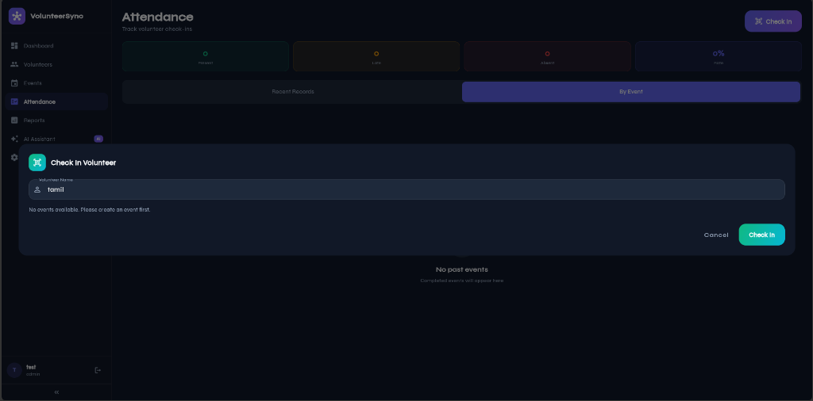

# VolunteerSync App Source Code

This repository contains the complete Flutter source code for the VolunteerSync application (excluding the web build deployment folder).

## 🚀 Project Overview
VolunteerSync is a platform designed to connect and coordinate volunteers with community events, featuring modern UI dashboards, attendance check-ins, reports, and AI helper chats.

## 🛠️ Tech Stack
- **Framework**: Flutter (Dart)
- **Database / Backend**: Supabase
- **Deployment Platform**: Vercel (Web deployment)

## 🏃 How to Run the App Locally

### Prerequisites
- Flutter SDK installed (v3.0 or higher)
- Android Studio or VS Code with Flutter extension
- Supabase project credentials

### Execution Steps
1. Clone the repository:
   ```bash
   git clone https://github.com/Tamilarasan13092005/volunteersync-app.git
   cd volunteersync-app
   ```
2. Install dependencies:
   ```bash
   flutter pub get
   ```
3. Run the development server (for web or mobile):
   ```bash
   flutter run
   ```

## 🖼️ Screenshots


